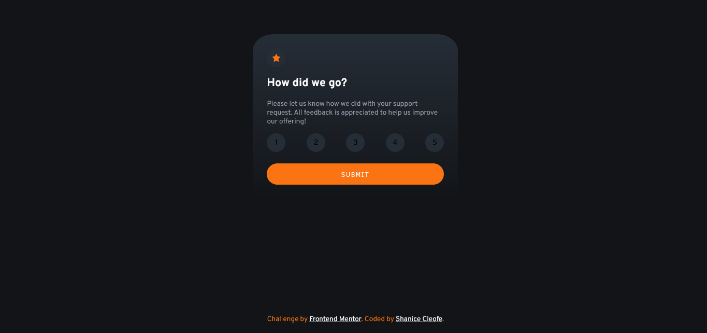
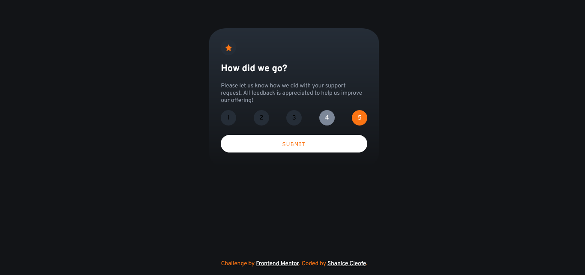

# Frontend Mentor - Interactive rating component solution

This is a solution to the [Interactive rating component challenge on Frontend Mentor](https://www.frontendmentor.io/challenges/interactive-rating-component-koxpeBUmI). Frontend Mentor challenges help you improve your coding skills by building realistic projects.

## Table of contents

- [Overview](#overview)
  - [The challenge](#the-challenge)
  - [Screenshot](#screenshot)
  - [Links](#links)
- [My process](#my-process)
  - [Built with](#built-with)
  - [What I learned](#what-i-learned)
- [Author](#author)

## Overview

### The challenge

Users should be able to:

- View the optimal layout for the app depending on their device's screen size
- See hover states for all interactive elements on the page
- Select and submit a number rating
- See the "Thank you" card state after submitting a rating

### Screenshot

## Desktop Preview

---



## Desktop Preview States

---



## Desktop Thank You State

---


## Mobile Preview

---


## Mobile Preview States

---


## Mobile Thank You State

---


### Links

- Solution URL: [Solution](https://www.frontendmentor.io/solutions/interactive-rating-component-Kp7Qzt2OEL)
- Live Site URL: [Interactive Rating Component Layout](https://sdacleofe.github.io/interactive-rating-component-main/)

## My process

### Built with

- Semantic HTML5 markup
- CSS custom properties
- FlexBox
- CSS Grid
- Mobile-first workflow
- ESLint
- StyleLint

### What I learned

Finished my day with this Interactive Rating Component using HTML5, CSS, and JS ES6 which incorporate with ES6 feature and standard syntax working with DOM and event handling. Plus, I have learned new things too, such as using the StyleLint and ESLint tools which is used for web development to ensure code quality and maintainability.

Additionally, here are some of my code snippets.

```css
:root {
  /* Primary */
  --orange: hsl(25deg 97% 53%);

  /* Neutral */
  --white: hsl(0deg 0% 100%);
  --light-grey: hsl(217deg 12% 63%);
  --medium-grey: hsl(216deg 12% 54%);
  --dark-blue: hsl(213deg 19% 18%);
  --very-dark-blue: hsl(216deg 12% 8%);
}
```

Been using these custom properties for readability and efficiency while working on this project.

```js
ratingNumberElements.forEach((ratingNumberElement) => {
  ratingNumberElement.addEventListener('click', (e) => {
    if (previousClickedElement) {
      previousClickedElement.classList.remove('clicked')
    }
    e.target.classList.add('clicked')
    selectedValue = e.target.getAttribute('data-value')
    previousClickedElement = e.target
  })
})

submitButton.addEventListener('click', () => {
  if (selectedValue !== undefined && selectedValue !== null) {
    userRatingModal.style.display = 'block'
    successModal.style.display = 'none'
  }

  if (selectedValue.trim() !== '') {
    userRatingModal.style.display = 'none'
    successModal.style.display = 'block'
    paragraphContent.innerText = `You selected ${selectedValue} out of 5`
  }
})
```

Use single quotes instead of double quotes, and it is also fine to omit semicolon rules in JavaScript."

### Useful resources

- [ChatGPT](https://chat.openai.com/) - This helped me for finding answers to my questions. I really liked this pattern and will use it going forward.

## Author

- Website - [Shanice Cleofe](https://github.com/sdacleofe/about-me)
- Frontend Mentor - [@sdacleofe](https://www.frontendmentor.io/profile/sdacleofe)
